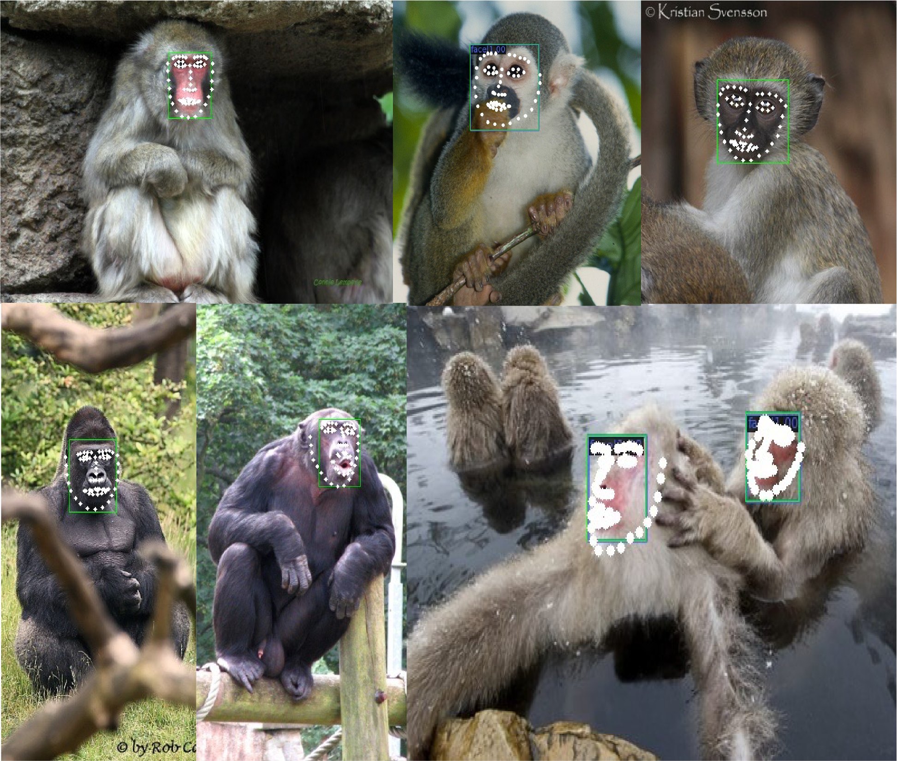

# PrimateFace: A deep learning-based system for primate facial analysis

<strong><a href="URL_FOR_PAPER">Paper</a></strong> | <strong><a href="URL_FOR_PROJECT_PAGE">Project Page</a></strong> | <strong><a href="URL_FOR_HUGGINGFACE_DEMO">HuggingFace Demo</a></strong>

*Project under development*

*MacFace == PrimateFace*

Understanding primate social communication and affective states requires precise detection and tracking of facial landmarks, which present unique challenges in non-human primates. Here, we introduce PrimateFace, an unprecedented cross-species primate dataset containing over 230,000 images, with extensive diversity and challenging natural settings.

<!--  -->

### Directories
data: This directory contains the PrimateFace dataset, which includes over 250,000 images of myriad primate species, providing a challenging benchmark for primate face analysis. It also includes any relevant data files used in the project.

docs: This directory contains the paper detailing our methodology, results, and analysis. It also contains any other relevant documentation for the project.

results: This directory contains the output data and analysis results generated by the scripts in the "src" directory.

scripts: This directory contains the code for the models for performing face detection and keypoint tracking. It also includes any utility scripts or libraries used.

src: This directory contains the source code for the project, including the models, training and testing scripts, and any other relevant code.

tests: This directory contains scripts for testing the functionality and performance of the models.

### Model
Our cutting-edge MegaPrimateFace models, utilizing transformer and lightweight real-time architectures, exhibit robust performance and generalizability across tasks, surpassing previous benchmarks in size, species diversity, and cross-species generalizability

### Dataset
To promote further research in the field of primate face analysis, we open-source our dataset and models. Fine-tuned models and Google Colab notebook tutorials are also provided to foster further research in primate face analysis.

### License
This project is licensed under the MIT License. See the LICENSE.md file for details.

### Getting Started
To get started with using the code in this repository, clone the repository to your local machine and install any necessary dependencies. Then, use the scripts in the "scripts" directory to train and test the models on your own data.

### Contributing
Contributions to this project are welcome and encouraged. If you notice any bugs or have ideas for additional features, please submit a pull request or open an issue on the GitHub repository.
