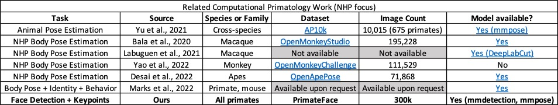

# PrimateFace: Bridging the gap in primate face analysis

PrimateFace is notable as the first large-scale cross-primate species face dataset.

Here's a non-inclusive snapshot of related work:

On the other hand, there has been a TON of work towards quantifying natural primate behavior. Here are some relevant datasets and models addressing this goal:

todo: add the table here and add all appropriate links
